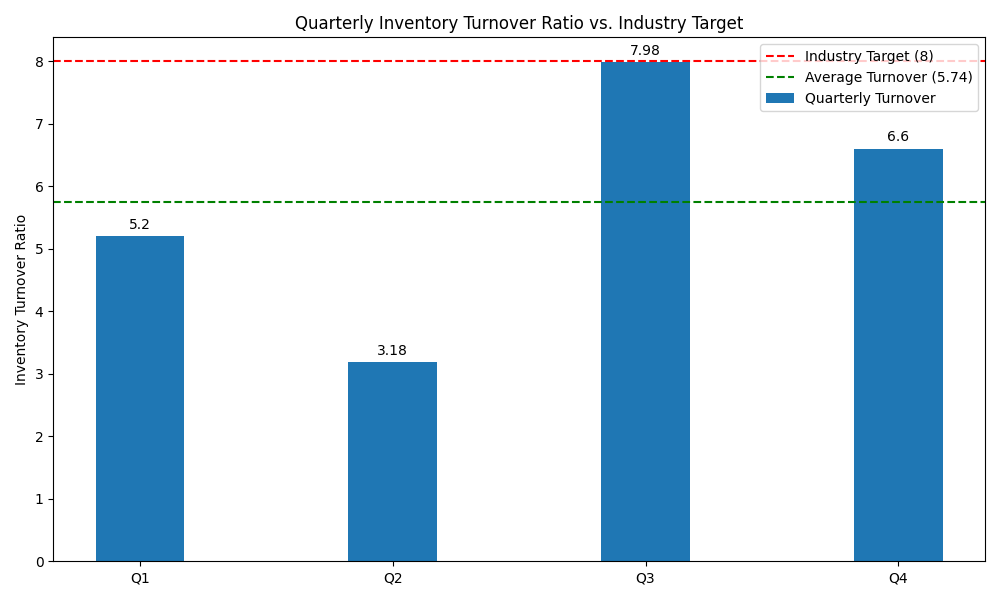

# Retail Performance Analysis: Inventory Turnover Ratio

This report provides a comprehensive analysis of the company's inventory turnover ratio for the fiscal year 2024. The analysis highlights a significant gap between our current performance and the industry benchmark, indicating a critical need to optimize our supply chain and demand forecasting strategies.

Contact for this analysis: 23f2000873@ds.study.iitm.ac.in

## Data Visualization

The following chart illustrates our quarterly inventory turnover ratio compared to the industry target of 8.

Inventory Turnover Ratio - 2024 Quarterly Data:
Q1: 5.2
Q2: 3.18
Q3: 7.98
Q4: 6.6
Average: 5.74

Industry Target: 8

## Key Findings

- **Quarterly Performance Fluctuation:** The inventory turnover ratio shows significant volatility throughout the year, with a low of 3.18 in Q2 and a high of 7.98 in Q3.
- **Below Industry Benchmark:** The annual average inventory turnover ratio is **5.74**, which is considerably below the industry target of 8.
- **Inconsistent Performance:** While Q3 nearly met the target, the performance in other quarters, especially Q2, pulled the average down. This inconsistency points to potential issues in our inventory management practices.

## Business Implications

A low inventory turnover ratio has several negative consequences for the business:

- **Increased Holding Costs:** Excess inventory leads to higher storage, insurance, and management costs, directly impacting our profitability.
- **Tied-Up Capital:** A significant amount of capital is locked in unsold inventory, which could be better utilized for other strategic investments or operational needs.
- **Risk of Obsolescence:** Holding inventory for longer periods increases the risk of products becoming obsolete, leading to write-offs and financial losses.
- **Reduced Efficiency:** A low turnover ratio is a key indicator of inefficiencies in our supply chain and sales processes.

## Recommendations to Reach the Target of 8

To address these challenges and achieve the industry target of 8, we recommend focusing on the following areas to **optimize supply chain and demand forecasting**:

1.  **Enhance Demand Forecasting:**
    *   **Implement Advanced Analytics:** Adopt machine learning models to improve the accuracy of demand forecasts. These models can analyze historical sales data, market trends, seasonality, and even external factors like economic indicators.
    *   **Collaborative Forecasting:** Work more closely with the sales and marketing teams to incorporate their insights into the forecasting process.

2.  **Optimize Inventory Management:**
    *   **Adopt a Just-in-Time (JIT) Approach:** For products with predictable demand, consider implementing a JIT inventory system to minimize holding costs.
    *   **Segment Inventory:** Categorize products based on their sales velocity (e.g., using ABC analysis) and apply different inventory policies for each category. High-demand items should be managed more closely to avoid stockouts, while slow-moving items should be reduced.

3.  **Improve Supply Chain Collaboration:**
    *   **Strengthen Supplier Relationships:** Work with suppliers to shorten lead times and improve delivery reliability.
    *   **Implement Vendor-Managed-Inventory (VMI):** For key suppliers, explore VMI programs where the supplier takes responsibility for managing our inventory levels.

4.  **Manage Slow-Moving Stock:**
    *   **Promotions and Discounts:** Develop targeted marketing campaigns and promotional offers to clear out slow-moving inventory.
    *   **Data-Driven Decisions:** Use data to identify at-risk inventory early and take proactive measures to sell it before it becomes obsolete.

By implementing these recommendations, we can improve our inventory turnover ratio, reduce costs, and free up capital, ultimately leading to a more efficient and profitable business.
